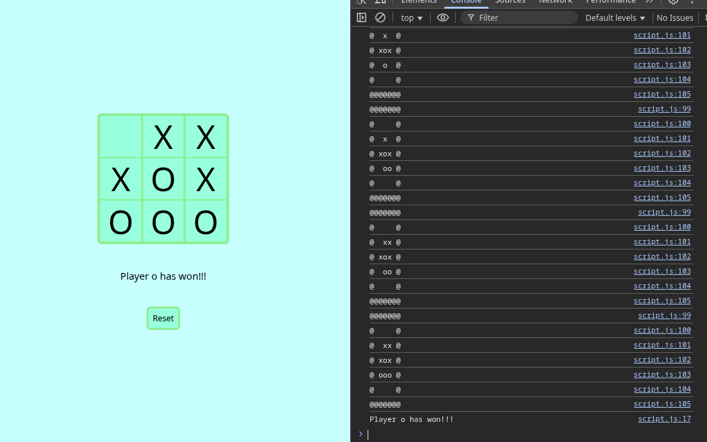

# tic-tac-toe

Simple tic-tac-toe game build using raw html, css and javascript.

Created as way to practice encapsulation through IIFEs without
overloading myself with a project that's too large.

**TODO:**
- [ ] fix bad implementation of player flipping

Can be played simply by clicking on the desired boxes. Checks
for illegal moves, a.k.a. trying to play on a cell that's already full.

    
    

 
Also has a check for when the game is over either by a player winning
or by the board being full and coming to a draw.

    
    

Full *'logs'* are available on the console printing the board on each step.
The game can also be manually played from the console using
`gameBoard.play(grid_position)`, where `grind_position` maps to the table below.

| | | | | |
|-|-|-|-|-|
| |0|1|2| |
| |3|4|5| |
| |6|7|8| |
| | | | | |

